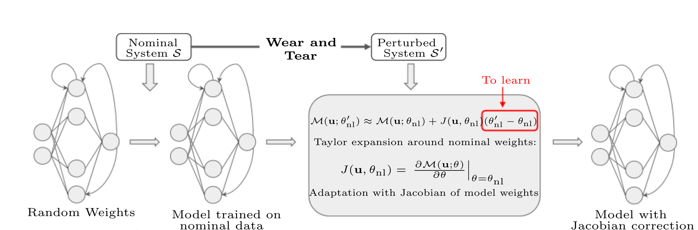
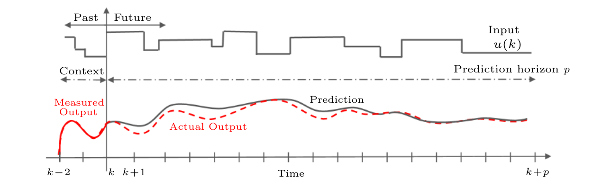

# JFR Baseline for SubGD

This repo extends the orginal repo to the few-shot setting and implements JFR as baseline for RLC.

The data generatation code is can be found in [multitask](multitask).

JFR baseline for the RLC system can be found in [examples/RLC/jfr.py](examples/RLC/jfr.py).

Notebooks for plots and results are in the [notebooks](notebooks) folder.


#

# On the adaptation of recurrent neural networks for system identification

This repository contains the Python code to reproduce the results
of the paper [On the adaptation of recurrent neural networks for system identification](https://arxiv.org/pdf/2201.08660.pdf) by Marco Forgione, Aneri Muni, Dario Piga, and Marco Gallieri. 

We introduce a **transfer learning** approach which enables fast and efficient adaptation
of Recurrent Neural Network models. 

A nominal RNN model is first identified using available measurements.
The system dynamics are then assumed to change, leading to an unacceptable degradation of the nominal model performance  on the **perturbed system**.

To cope with the  mismatch, the model is augmented  with an additive correction term trained on fresh data from the new dynamic regime.
The correction term is learned through a **Bayesian Linear Regression** (BLR) method defined
in terms of the features spanned by the nominal model's **Jacobian** with respect to its parameters.



A **non-parametric view** of the approach is also proposed, which extends the recent work on **Gaussian Process**  with **Neural Tangent Kernel** (NTK-GP) 
discussed in [1] to the RNN case (RNTK-GP). 

Finally, we introduce an approach to **initialize the RNN state** based on a **context of past data**, so that an estimate of the initial state is not needed on top of the parameter estimation.



# Folders:
* [examples](examples): examples transfer learning with
  * [CSTR reactor](examples/CSTR)
  * [Non-linear RLC circuit](examples/RLC)
  * [Wiener-Hammerstein system](examples/WH) (not discussed in the paper)
* [diffutil](diffutil): computation of:
  * full parameter Jacobians matrix in [jacobian.py](diffutil/jacobian.py)
  * Jacobian-vector / transposed Jacobian-vector products in [products.py](diffutil/products.py)
* [torchid](torchid):  system identification tools with PyTorch. Copied from https://github.com/forgi86/pytorch-ident


# Software requirements:
Simulations were performed on a Python 3.8 conda environment with

 * numpy
 * matplotlib
 * pandas
 * pytorch (version 1.8.1)
 
These dependencies may be installed through the commands:

```
conda install numpy scipy pandas matplotlib
conda install pytorch torchvision cudatoolkit=10.2 -c pytorch
```

# Citing

If you find this project useful, we encourage you to

* Star this repository :star: 
* Cite the [paper](https://arxiv.org/pdf/2201.08660.pdf) 

To cite the paper, you may use the following BibTex entry:
```
@article{forgione2022adapt,
  title={On the adaptation of recurrent neural networks for system identification},
  author={Forgione, M. and Muni, A. and Piga, D. and Gallieri, M.},
  journal={arXiv e-prints arXiv:2201.08660},
  year={2022}
}
```

Using the IEEEtran bibliography style, it should look like:

M. Forgione, A. Muni, D. Piga, and M. Gallieri, "On the adaptation of recurrent neural networks for system identification,"
*arXiv preprint arXiv:2201.08660*, 2022. <br/><br/>

# Bibliography
[1] W. Maddox, S. Tang, P. Moreno, A. Wilson, and A. Damianou, "Fast Adaptation with Linearized Neural Networks,"  
in *Proc. of the International Conference on Artificial Intelligence and Statistics*, 2021. <br/><br/>
